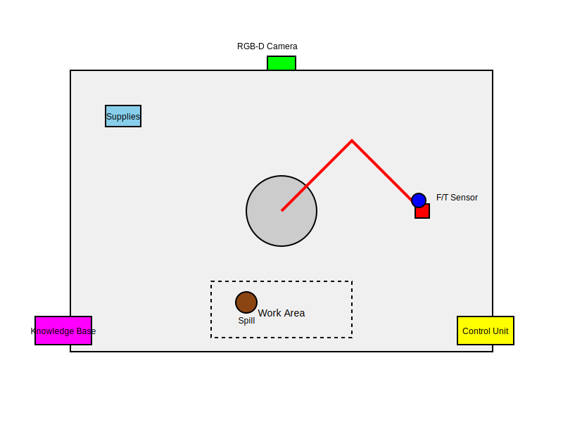

[](https://mermaid.live/edit#pako:eNqdVl1P2zAU_StWEG9Ug5ZNLA-TxtfERlFFuyeXBze5abM6dmY7A4T47_gr31UH6Utzj885uTexj_ISRDyGIAzWguQbtLhcMqR_c0WEwndEFYJQdEvYuiBrQDPBs1w9oNHoG7q7ne0kRCBlytYPzkizLPvqSQkSKYgXRG5vWMJxhSADIYOJjKiUMy_tSazRL8YfKcRrOCcScFUhU3phi2JFxmFGCWMgsL2bL7ygsWzpMxAR5KaVKY8LCrgGkEO8sEt0o7J_qeAsA6Y0ChQ3AGSRcsAO0aqn3NiVzbqq026LYkXfRbYQ5A9EiosUJNY1agJe2KGV0gvOlOCU6vvd85U2jwyKariW11gpvnqCqDD92JtWVS2pIKuYA5NcXAPEKxJtsStRWXtVm2R1ZeE3GBe4Wq4gr-5Ru1vgdx4TpZ9ScycgD_Z3hF_omjjekrl_WazcAXKtS4ea3wXJQJAblhcK3_84H1165KGmXHO9ixZc_C3AybFFPjnIWzb4P3nK1BUzB1dIbCtUlg3aQh-elHpLM60tyw4bxGkaCZ5vOANcX_p1YHE5aWeanSfFv4HuQLtfoSO3ptlHbM-zj1lPUSZV-Z4OD_W2prqhuXqm4F-TNNcu8lCSUhoeJMfJ2ZHUO30L4cFJdApnx74cPaax2oTj_KmpNSnnlfHJyXj89bRSTyaTvdJ-yjmj8ZfVuz3agfdxfTP_Pq7uhaB_Ep9Xk_c_hW4UDvBox-IAg248DrNoROQwgzowB-g70TnAoR-fA0x25KdzmUzgPyb9aWTjVCbJXnlwFOiAykga60-aF2O1DNQGMlgGob6MidgugyV71TxSKD5_ZlEQKlHAUSB4sd4EYUKo1FVhu75MiY71rEIhTvXemLovJvvh9PoGPoUtjA)

1. **Workstation**: The large rectangular area representing the workspace where the robotic arm operates.

2. **Robotic Arm**: Shown in red, with its base at the center of the workstation. The arm is depicted in an extended position, reaching towards the work area.

3. **Gripper**: At the end of the robotic arm, represented by a small red rectangle.

4. **RGB-D Camera**: Positioned above the workstation (green rectangle), providing a top-down view of the entire work area.

5. **Force/Torque Sensor**: A small blue circle near the gripper, used for precise control and feedback during task execution.

6. **Control Unit**: Located in the bottom-right corner (yellow rectangle), representing the central processing unit that manages the system's operations.

7. **Knowledge Base**: Positioned in the bottom-left corner (purple rectangle), storing information about objects, tasks, and procedures.

8. **Cleaning Supplies**: A designated area (light blue rectangle) where cleaning materials are stored.

9. **Work Area**: A dashed rectangle indicating the primary area where tasks are performed.

10. **Spill Location**: Represented by a brown circle within the work area, simulating the coffee spill.

This diagram provides a clear visual representation of how the different components of the robotic arm system are arranged in the workspace. It shows the relative positions of the arm, sensors, and other key elements, giving a good overview of how the system would be set up to handle tasks like cleaning a coffee spill.

The robotic arm is centrally located, allowing it to reach all areas of the workspace. The RGB-D camera provides a comprehensive view of the entire area, enabling the system to locate the spill and navigate the arm effectively. The cleaning supplies are positioned within easy reach of the arm, and the control unit and knowledge base are placed out of the way but still within the workspace for easy access and maintenance.

This layout allows the system to efficiently perceive its environment, plan its actions, and execute tasks based on natural language prompts, as we discussed in the earlier system design.